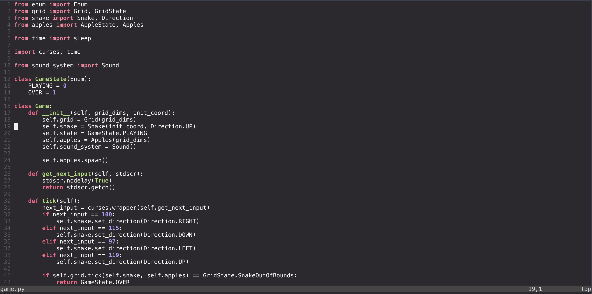

# Duokai
Basically a Lua/Lush.nvim implementation of the [Monokai Pro](https://monokai.pro) colorscheme for Neovim, but it's slightly more colorful.


Anything I could change? Let me know!

## Installation with Packer
Simply `use` both `monokaipro.nvim` and `lush.nvim` in your Packer config, making sure that `lush.nvim` appears before `monokaipro.nvim`.
```lua
require('packer').startup(function (use)
    -- plugins
    use 'rktjmp/lush.nvim'
    use 'varun-ramani/monokaipro.nvim'
    -- more plugins
end)
```

## Enable colorscheme
At some point after the packer config, run the following:
```lua
vim.opt.termguicolors = true
vim.cmd [[colorscheme monokaipro]]
```
Upon a restart of Neovim, this colorscheme should be active.
